# 一、简介
易聚趴(Easy Party)，一个供北大同学使用的网页前端，基于html，css和javascript，旨在使得同学们之间的小型聚会活动的计划、发起、进行变得简单、快乐和有趣。

# 二、小组信息
## 1.小组队名
MeowPKU(Make Each One Warm in PKU)

## 2.成员信息
|职务|姓名|学号|年级|分工|
|:-:|:-:|:-:|:-:|:-:|
|组长|肖萧|2100016653|21级|撰写代码、监督项目实施、对项目进行版本维护|
|组员一|税远志|2100016640|21级|撰写代码、引出阶段性想法、协助任务分工完成|
|组员二|罗泽阳|2100016650|21级|撰写代码、提出改进意见、分析利用信息资源|
|组员三|果果|2000093014|20级|撰写代码、拓展项目思路、改善项目审美性|
|组员四|王涵|2100016625|21级|撰写代码、论证设计合理性、补充项目靓点|

# 三、网站项目定义
## 1.网站名称、logo

**网站名称**

### 易聚趴（Esay Party）

**网站logo**

## 2.设计说明
### a)情境
#### i.情境描述
在学校里，想要或需要进行多人活动时，同学们可能找不到一起的搭档、伙伴。偌大的学校里，想要进行如爬山、桌游、看电影、一起听歌等活动，我们一般只能邀约熟悉的若干朋友，但常常难以做到意愿统一；如果去树洞发布邀约帖子，由于树洞人群在线的人数动态变化大和树洞繁杂的消息，邀约很容易石沉大海，很难被真正有相同兴趣的同学看见。

||角色|环境|事件起始|关注点|发生点|结果|
|:-:|:-:|:-:|:-:|:-:|:-:|:-:|
|情境1|张有志，男，北京大学信息管理系大一学生，喜欢玩桌游和剧本杀|周末，张有志想约人一起打剧本杀，但他初来乍到，在学校没有熟悉的人。|张有志首先询问宿舍的舍友，舍友要不没有时间，要不没有兴趣|张有志决定在树洞问有没有人一起玩剧本杀|他的树洞没有得到回复，且很快被新的树洞淹没|张有志放弃了玩剧本杀的想法，一个人在宿舍发呆|
|情境2|孙大川，男，北京大学元培学院学生||||||
|情境3|||||||

|情境|情境简介|代价度|影响度|未满足度|总分|感受度|
|:-:|:-:|:-:|:-:|:-:|:-:|:-:|
|情境1|寻找活动队友|||||
||寻找活动需求|||||
||分享活动体验|||||

目标情景：

一方面，本网站帮助同学们发布约人邀请，这一邀请帖子可以设置时间、地点、人数范围、性别、用户备注。
网站的邀约展示页面可以展示最新发布的邀约帖，也可以根据邀约属性划分为不同的类型区域，如桌游类、电影类、外出游玩类等区域。
用户可以自己给发送的帖子贴标签，从而使它进入对应的类型区域，让有相关兴趣的人更方便看到；同时，网站也具有分析帖子属性关键词功能，自动将无tag帖子放入对应区域。
根据用户发送的帖子的tag，系统会自动为用户进行用户画像。之后用户打开网页的类型区域版，会首先展示用户爱好的类型。
帖子有评论区，其他同学可以了解详细情况。接收邀约的同学会被拉入与发起者共有的群组，群组人数会在评论区自动动态展示更新，满员后自动关闭评论区（可后续论证其合理性）。
如果帖子没有得到回复，网站会记录用户的邀约受挫记录，在其他用户发布相关贴子时进行提示。
邀约可以分短期邀约和长期邀约、临时起意和长期兴趣，短期、临时的邀约过一定时间后会被系统清除。

另一方面，网站有分享板块，成功组队玩耍后，用户可以在此分享照片、视频、文字。
用户有信誉积分，爽约、发起不良邀约后会扣分，给予一定处罚。经常准时赴约和邀约的人会加分，高分段用户将被给予“聚趴达人”称号。
网站有玩耍推荐网页。管理员首先负责更新相关玩物、景点推荐，如新的剧本杀、餐馆、某处景点。另一方面，聚趴达人可以申请负责相关推荐板块的管理，管理每位同学上传的推荐语。

#### ii.故事板

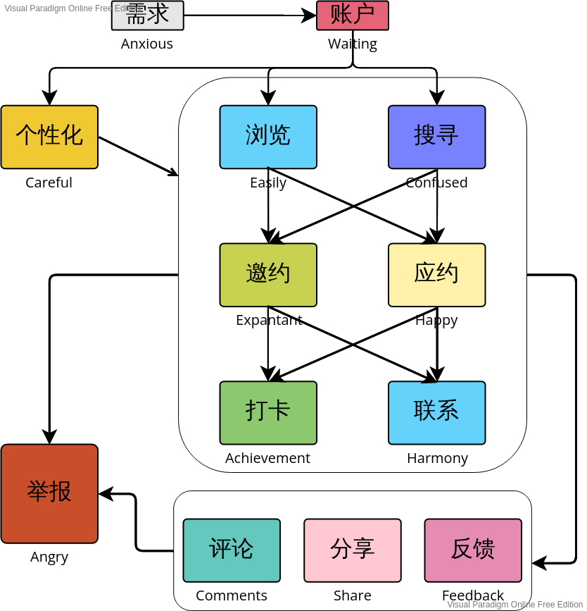

### b)用户
#### i.用户调研报告
##### 问卷

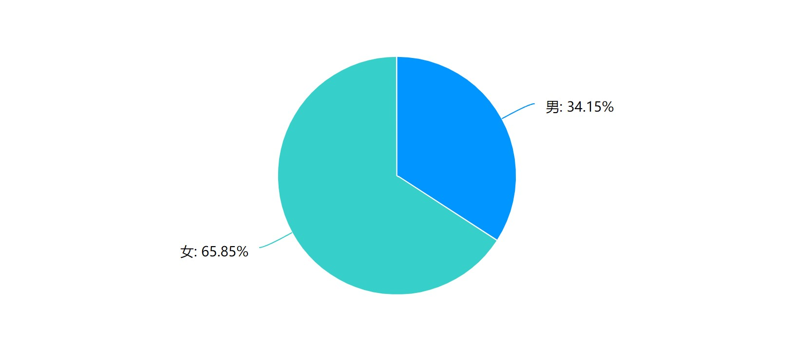
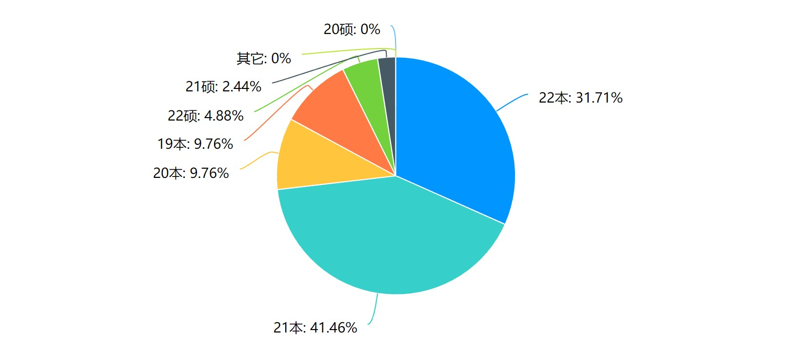
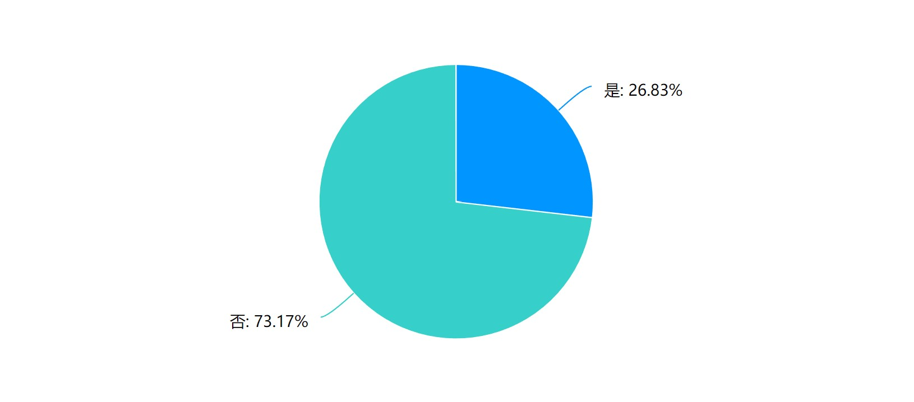

在本次调查问卷中，我们已收集41位学生的信息，由于数据量较小。从结果来看，填写问卷调查的同学里女生占65.85%，男生占34.15%。按年级来看，占比最小的为21级硕士和22级硕士，而占比最多的是21级、22级本科生一共占73.17%。留学生占26.83%，剩下的是中国学生。 基于这一特点，可以看出低年级非留学生更适合作为我们主要的用户。可能是因为21、22级本科生在校度过的时间较短，个人在校内的交际圈可能比较小，在约人或者被约方面的需求更大。

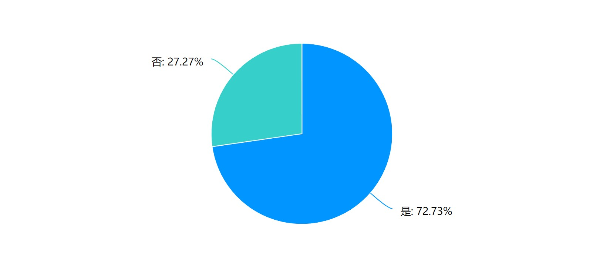

从问卷结果来看，72.73%留学生约人外出的时候更愿意约校内非留学生同学，而27.27%同学更愿意约校内留学生同学。更愿意约校内同为留学生的留学生同学一般不愿意扩大自己的交际圈，更不会愿意面向在校的所有同学发出邀约或是接收邀约，因此，我们认为留学生同学中，更愿意约校内非留学生的那一部分比不愿意的那一部分更适合作为我们的用户。

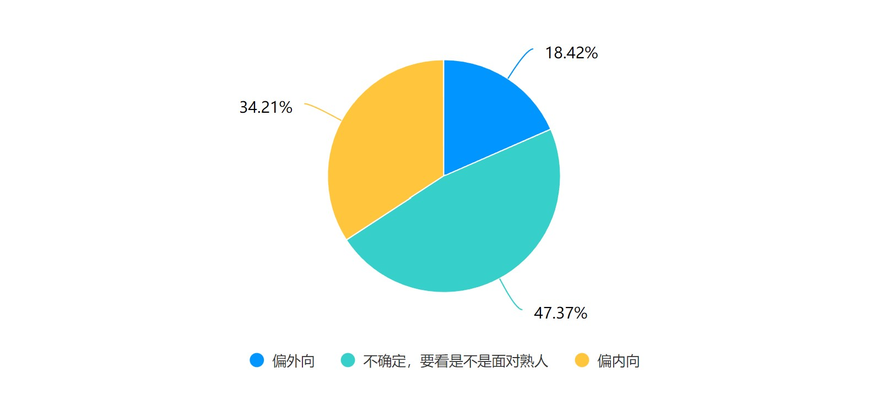

从问卷结果来看，我们的用户认为自己既不是完全偏外向也不是完全偏内向的占比较大，而认为自己偏外向和偏内向的同学相比之下都较少。在后续结合访谈得到的信息等，我们认为这三类用户在行为习惯上存在差异，推测这三类用户对网站提供的服务存在较为不同的关注点，可以作为我们划分用户人群的标准。

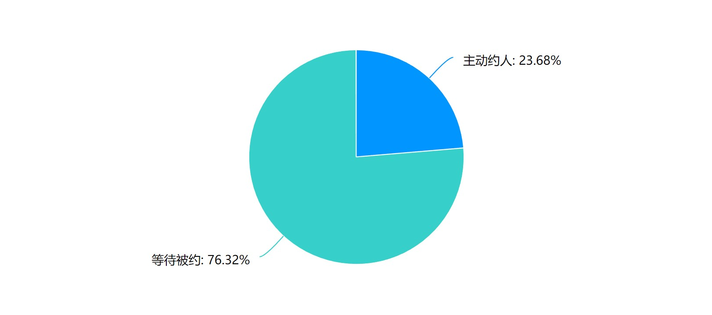

从问卷结果来看，我们的用户中有相当一部分是倾向于等待被约的。这些更倾向于等待被约的用户可以通过MEOW PKU网站找到符合自己需要的邀约，并能够尝试主动去约人。

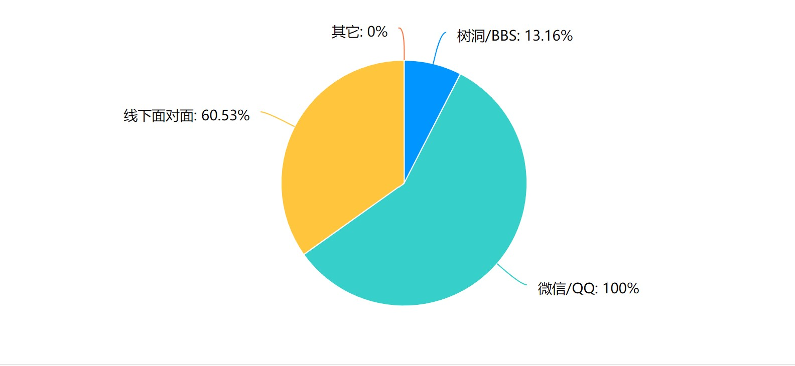

从问卷结果来看，我们的用户更习惯于在线上发出邀约（如通过微信、QQ等社交平台），更倾向于邀请相熟的朋友（如通过线下面对面邀请）。结合我们访谈得到的信息以及现实生活中的经验，之所以会有这样的特点可能是在线上与人交流会比线下交流更放得开、没那么尴尬，同时线上交流能够随时随地进行非常便利，另外，大家在社交上普遍防范意识比较强，对陌生人的戒备心比较重，也认为跟陌生人交流会比跟熟人交流更容易尴尬，因此在邀约时更倾向于邀请相熟的朋友。

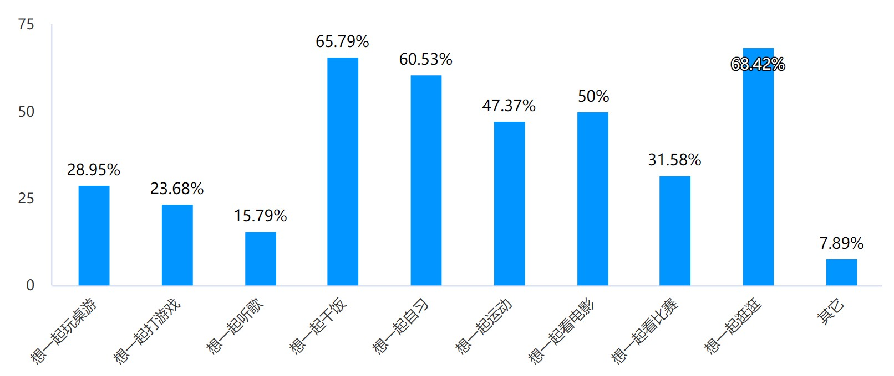

从问卷结果来看，我们的用户在需求上呈现多样化的特点，娱乐型需求（如一起吃饭、一起逛逛、一起看电影）和学习型需求（如一起自习）都占有较大的比例，同时，线下活动（如一起吃饭、一起逛逛）的邀约需求要远高于线上活动（如一起听歌、一起打游戏）的邀约需求。这也为我们设计网站的相关版面提供了参考（如按照活动类型对发布在平台上的邀约进行分面展示、根据用户的选择提供跟踪活动等相关措施以尽可能保障用户安全）。

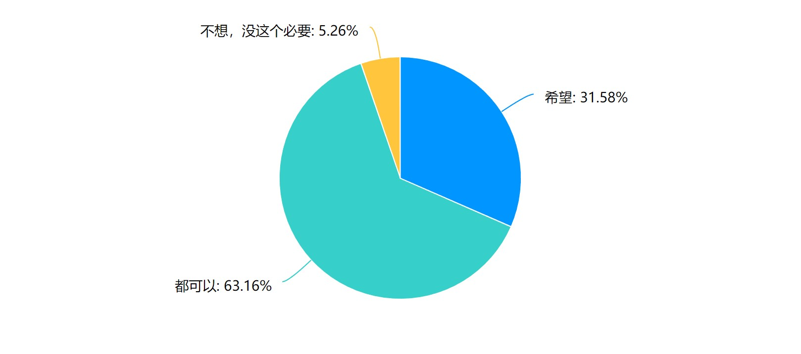

从问卷结果来看，我们的用户绝大部分都想要继续与一起进行某一活动的其他用户继续保持朋友关系。这也为我们的网站功能设计提供参考（如在注册时绑定用户的联系方式，由用户按照自身意愿决定是否公开）。

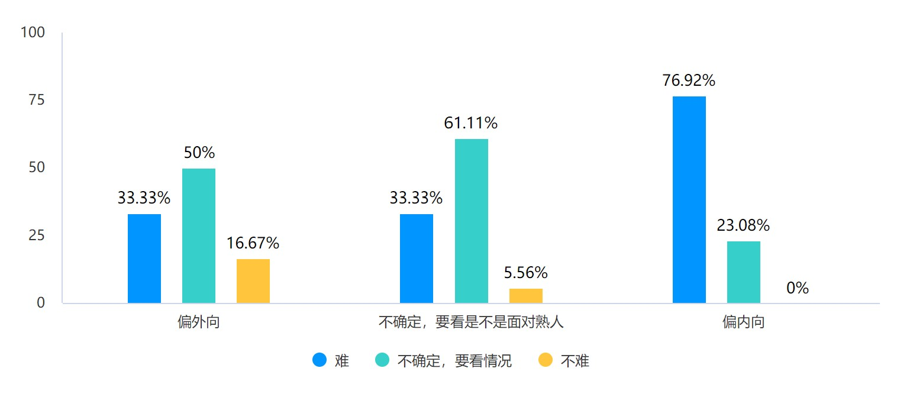
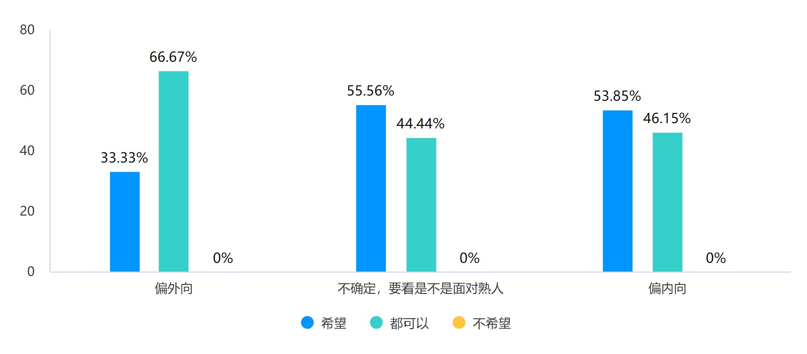

从交叉分析结果来看，性格偏内向的用户比性格偏外向的用户会更容易认为主动发出邀约是一件困难的事情，也会更期待自己约到的人是比较外向的人。基于这一特点，我们考虑根据一定的规则为用户颁发相应的头衔（如社交达人），为这一类有期望的用户提供参考。

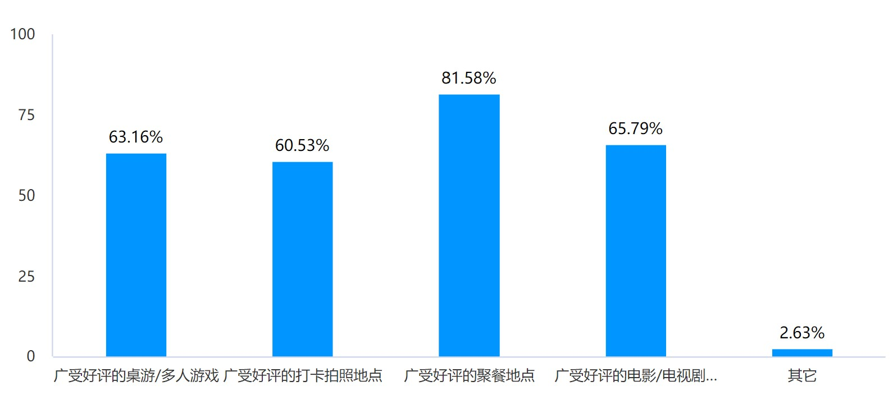
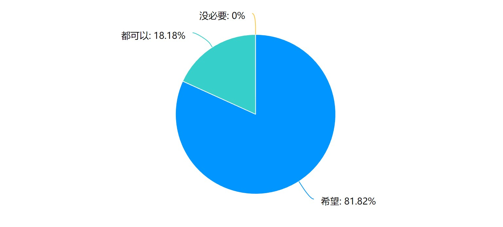

从问卷结果来看，我们的用户对各类推荐信息的需求都比较强，同时也希望推荐信息中除地点外包含具体的路线导航、预估人均花费等详细信息。

在本次问卷中，部分用户还提出了其他非常具有参考价值的建议，比如希望后台对所有用户进行实名（如绑定学号、真实姓名等）、跟踪线下活动（如到达预定时间时提醒用户进行“活动已结束，我已安全离开”的结束确认）防止动机不纯者给其他用户带来麻烦甚至造成伤害，同时也要注重保护用户隐私安全，还有希望推荐信息中的路线更多样化，同时路线的推荐也要贴合学生用户的身份（可能搭乘公共交通工具出行较多）等。
##### 访谈
###### 访谈报告一
**访谈时间**：2022年11月4日

**访谈方式**：面对面

**被访谈人**：王同学，北京大学21级在校本科生，爱好摄影，经常与伙伴相约出门游玩拍照

**问题1**：你认为自己在社交上属于偏外向型的人还是内向型的人呢？

**答**：社交这方面大部分情况还是比较内向的，会在主动跟别人交流这方面很犹豫，但是当对象是很熟悉的人或者需要我来调动气氛的时候会相当活跃

**问题2**：那如果对方是不太熟悉的人，并且在一对一交流的情况下，你认为自己属于内向型还是外向型呢？

**答**：内向吧，虽然感觉得到很尴尬但是也不知道该说点什么

**问题3**：如果现在你要参加一个多人活动（除了你以外还需要两个人或者更多人参与），主动约人组队和等待被约你更倾向于选择哪一个呢？

**答**：这个也要看对方是不是我熟悉的人了。如果是不太熟悉的，就是那种基本没怎么说过话的对象，就会非常被动了，可能是因为自己也不清楚要怎么主动邀请，还有怎么适当保持客套。很熟悉的人随便怎么聊都可以很轻松吧，不用考虑邀请的时候被拒绝该怎么办，当然也是我自己比较敏感了

**问题4**：那你认为主动约人对你来说难吗？如果觉得难的话，可以说说具体难在哪些方面吗？

**答**：有点难吧。对我来说难题可能在于自己很害怕出现尴尬的情况，比如被不太熟悉的人拒绝，还有对方忘记没回信息的时候也不知道该不该再提醒。哦，还有一点可能就是缺乏一些渠道吧，基本只会用微信、QQ啊这些，还有跟别人面对面交流的时候去提出邀请会觉得轻松一点

**问题5**：如果出于某些需要你现在要约校内的其他同学，你会从那些渠道发出邀约呢？

**答**：我会首先考虑身边比较熟悉的人，比如舍友、部门的伙伴、系里面交流比较多的人，所以应该会选择微信或者面对面直接邀请吧，就是在遇到的时候直接提出来这样子。

**问题6**：那如果相熟的人拒绝了，但你又十分需要有人一同参与某个活动，你会通过哪些渠道找人呢？

**答**：那应该就去树洞了吧，也没别的渠道了。不过树洞发这这一类（邀请）还是遇到问题的，根据经验来说树洞总是会遇到一些嗯……很奇怪的人，况且树洞刷新太快了，发的洞还挺容易沉的

**问题7**：如果有一个线上平台，用户在上面能够面向全体用户发出邀约或是响应其他用户发出的邀约，你认为这个平台对你来说有帮助吗？会觉得跟不太相熟的人线上交谈更能缓解自己的尴尬心理吗？

**答**：嗯，我认为是有用的，因为如果很需要约人但是熟人都很忙的话，就只好邀请其他的人。但是就像上个问题回答的，我能想到的校内比较好的平台只有树洞，可是树洞发这种帖子的话就很容易沉，很难顺利约上人，如果专门把这个抽出来的话就应该就不存在沉掉的问题了吧。而且跟不熟的人的话……感觉线上确实会没那么尴尬的样子。

**问题8**：你一般出于哪些需要约人呢？

**答**：大部分都是休闲娱乐方面的需要吧。比如一起去食堂试一道没吃过的菜，或者一起出去玩、出去拍照，再或者一起去线下观赛。不过由于身边熟人里喜欢摄影和看电竞比赛的人不算很多，所以经常也会出现约不到的情况，比较苦恼。

**问题9**：假设你通过一些渠道在校内约到了一些不太相熟的人，你会希望在结束活动之后继续跟他们保持朋友关系吗？

**答**：还是希望的，毕竟内心还是想认识一些新朋友的，下次有需求的时候他们也可以成为我的planB

**问题10**：你会希望自己约到的人是比较外向的人吗？

**答**：希望，不太想承担社交的压力，所以希望对方是主动推进或者说主动打开话题的人

**问题11**：有的时候会有种想跟人出去玩但是不知道跟谁一起、也不知道玩什么的苦恼，假设这个时候有个软件能为你提供游玩的信息，你会希望它为你提供哪些信息呢？

**答**：从我个人的角度的话，当然还是希望像适合组队拍照打卡的地点，但是也不全是吧，还是希望提供尽可能多的游玩项目和具体信息吧，比如可以用分区的形式推荐，然后信息希望能具体一些，比如详细的地址还有如果是需要提前预定门票什么的希望能标注一下好能提前准备。当然如果能直接在这个软件里导航什么的就更方便了

###### 访谈报告二
**访谈时间**：2022年11月6日

**访谈方式**：面对面

**被访谈人**：巴大玛同学，北京大学21级在校本科生留学生，爱好游泳健身聊天，经常与伙伴进行对话。

**问题1**：你认为自己在社交上属于偏外向型的人还是内向型的人呢？

**答**：我觉得我是个外向的人。

**问题2**：那如果对方是不太熟悉的人，并且在一对一交流的情况下，你认为自己属于内向型还是外向型呢？

**答**：我属于是个外向的人。 

**问题3**：如果现在你要参加一个多人活动（除了你以外还需要两个人或者更多人参与），主动约人组队和等待被约你更倾向于选择哪一个呢？

**答**：我自己先去找他们。如果我自己等待被约的话，我没有大的可能和我自己合心的朋友一起组队， 但如果我自己主动去约他们的话可以选择自己

**问题4**：那你认为主动约人对你来说难吗？如果觉得难的话，可以说说具体难在哪些方面吗？

**答**：有点难，看我的mood。看那个场景对我来说是否重要。我心里会感觉别人会怎么想我，怕他们不接受我。

**问题5**：如果出于某些需要你现在要约校内的其他同学，你会从那些渠道发出邀约呢？

**答**：在微信群里, 见面的时候，课间休息的时候、或者在参加某个活动时会发出邀约或被约。

**问题6**：那如果相熟的人拒绝了，但你又十分需要有人一同参与某个活动，你会通过哪些渠道找人呢？

**答**：要是相熟的人拒绝了，我会找班里的不太相熟的人（一起上课，平时互相不说话的但是在同一个微信课程群里面的），或者会在P大树洞里找人约。

**问题7**：如果有一个线上平台，用户在上面能够面向全体用户发出邀约或是响应其他用户发出的邀约，你认为这个平台对你来说有帮助吗？会觉得跟不太相熟的人线上交谈更能缓解自己的尴尬心理吗？

**答**：会觉得这个很有帮助。

**问题8**：你一般出于哪些需要约人呢？

**答**：看当时的需要，包括娱乐方面的学习方面的需要，学习的时候，我想和自己学院的学生见面；吃饭的时候，我想和其他学院的学生见面。做某种事情，我喜欢和别人一起陪着。

**问题9**：假设你通过一些渠道在校内约到了一些不太相熟的人，你会希望在结束活动之后继续跟他们保持朋友关系吗？

**答**：结束活动之后我心里会有感觉要不要继续保持朋友关系。如果我和他的共同的话题比较多，我们就会继续保持朋友关系， 

**问题10**：你会希望自己约到的人是比较外向的人吗？

**答**：我觉得各有各的特点。

**问题11**：有的时候会有种想跟人出去玩但是不知道跟谁一起、也不知道玩什么的苦恼，假设这个时候有个软件能为你提供游玩的信息，你会希望它为你提供哪些信息呢？

**答**： 我首先会想知道我约的人性格、简介。还想知道他想做的活动信息。

##### 用户划分
（受限于问卷调查获取的样本量，性别比例处的“较为均衡”指的是三类人群各自的性别比例基本上没有差异）
|                       |第一类人群用户（偏外向型） |第二类人群用户（有时外向有时内向型）   |第三类人群用户（偏内向型） |
|:----------------------|:--------------------------|:--------------------------------------|:--------------------------|
|基本属性               |人数较少；性别比例较为均衡 |人数较多；性别比例较为均衡             |人数较少；性别比例较为均衡 |
|行为习惯               |1. 认为主动邀约没那么困难；2. 比另外两类用户更愿意主动邀约；3. 比另外两类用户更愿意线下面对面发出邀约，出于对便利性的考量线上发出邀约也很多；4. 会使用树洞/BBS面向不熟的人发出邀约；5. 邀约类型广泛|1. 认为主动邀约较难；2. 倾向于等待被约；3. 更习惯线上发出邀约；4. 会使用树洞/BBS面向不熟悉的人发出邀约，但更担心安全性问题（如是否会遇到奇怪的人）；5. 邀约类型广泛|1. 认为主动邀约很难；2. 倾向于等待被约；3. 更习惯使用线上平台、比有时外向有时内向的人更倾向于线下向熟人发出邀约；4. 会使用树洞/BBS向不熟悉的人发出邀约，但更担心交流时的尴尬心理；5.	邀约类型广泛|
|对网站的关注点（推测） |推荐信息的丰富性、网站用户数量|用户隐私安全、人身财产安全保障|站内匿名性聊天机制|

#### ii.典型用户画像
|属性|描述|
|:--:|:----------|
|昵称|吃午饭等晚饭|
|性别|女|
|年龄|19岁|
|学历|在校本科生|
|互联网经验|能够熟练上网；主要进行通信交流、游戏娱乐、信息浏览、网络购物等活动；每天上网时间（PC端和移动端）在5小时以上；各类社交软件使用最多；|
|兴趣爱好|摄影、打游戏|
|人物简介|这位同学是一名大二在校学生，今年19岁，经常跟朋友相约去一些热门地点拍照，休闲时也会约朋友一起打游戏或者是看电竞比赛，在校内也时常约朋友一起逛逛校园拍拍照或是品尝新出的菜品。|
|用户行为|（形式）大多通过微信/QQ或是面对面线下的形式，倾向于线上邀请相熟的朋友；（频次）大约每个月约朋友出校游玩两到三次，大约每周在校内约朋友逛校园或品尝新菜品等两到三次，大约每两周约朋友看一次电竞比赛，大约每两周约朋友打一次游戏|
|烦恼经验|时常遇到朋友们没空、邀请被拒的情况，由于没有便捷渠道能够在校内约到其他兴趣相投的人一起去拍照游玩等，一些行程只好取消。|
|用户态度和观点|1. 线上发出邀约的原因：方便、能有效避免尴尬；2. 对约到的人的期待：兴趣相投、外向、准时守约等；3. 偏好的信息类型：校内外的美食、适合拍照游玩的宝藏景点、游戏相关资讯；4. 对向校内不认识的同学发出邀约的担心：性格不好相处、没有共同话题、爽约、动机不纯等|

|属性|描述|
|:--:|:----------|
|昵称|微笑|
|性别|女|
|年龄|22岁|
|学历|在校本科生|
|互联网经验|能够熟练上网，每天上网时间约6小时以上。每天主要进行信息交流、信息发布、信息浏览、信息共享、网络购物等活动。|
|兴趣爱好|游泳、聊天、健身|
|人物简介|这位同学是一名大一在校本科生，今年22岁。除了学习以外喜欢和朋友们约一起去图书馆、一起吃饭、一起游泳。|
|用户行为|（形式）大多通过微信/Instagram/Facebook或是面对面线下的形式，倾向于面对面邀请相熟的朋友；（频次）大约每个月约朋友出校游玩4到5次，大约每个月约朋友游泳2-3次，大约每天都约朋友一起去图书馆和食堂。|
|烦恼经验|有时候会遇到朋友们没空、邀请被拒的情况，因此心里感觉不舒服。|
|用户态度和观点|1. 线上发出邀约的原因：方便、认识新的朋友很有趣；2. 对约到的人的期待：兴趣相投、成熟、说话有趣；3. 偏好的信息类型：专业知识相关的推荐信息（如一些电影）、健身房、校内外的宝藏景点、校内外的美食等；4. 对向校内不认识的同学发出邀约的担心：性格不好相处、没有共同话题、三观不合等。|

### c)过程
#### i.接触点
需求、账户、个性化、浏览、邀约、搜寻、评论、应约、联系、打卡、分享、反馈、举报

#### ii.各接触点的用户任务
1. 需求

**用户任务：** 用户产生想要同其他人聚会的想法，抑或是在闲散时间想要进行诸如踏青、自习、参观等有意义的活动。一旦用户产生了诸如此类的想法同时又苦于难以找到志同道合的伙伴时，我们的产品就能对应于用户的需求。

**用户感受：** 用户苦于找不到和他一起进行某项活动的朋友，内心感到焦躁、不安和苦恼。

2. 账户

**用户任务：** 用户在我们的网站上注册账户或者是登陆账户，便于平台辨识、管理和服务用户。用户必须经过注册并登陆成功后才能接受平台提供的各种服务。

**用户感受：** 在注册阶段，长期的注册失败会让用户感到受挫和不耐烦。在登陆阶段，用户会因为一直登陆不上而感到焦急和恼火。

3. 个性化

**用户任务：** 用户修改个人信息，管理个人空间，整理自己的评论、帖子，以便其他用户更好地了解自己，向外界展示自己的良好形象，平台参考用户的个人信息对其进行有针对性的个性化服务。

**用户感受：** 用户修改自己的个人信息，如果修改过程过于繁琐，会引起用户的反感和不适，对于用户想修改而又不能修改的内容，如果呈现给用户会使用户感到焦急，对隐私和敏感信息会产生担忧。

4. 浏览

**用户任务：** 用户进入了网页，进行网页冲浪并获取用户想要的信息，包括新发布的邀约帖子、关于某一帖子的他人评论、其他人的活动分享、热门打卡景点推荐、热门游戏活动的测评等信息。

**用户感受：** 面对海量的信息，用户只关心他所想要的信息，如果不进行有效的信息筛选会使用户感到茫然和无所适从，用户拿到了想要的信息后应当要能确定信息的真实性、可靠性和失效性。

5. 邀约

**用户任务：** 用户拥有明确的活动目标但是缺乏和他一起开展活动的朋友，希望召集一批可以和他一起进行活动的伙伴，此时他可以发起邀约帖子，明确参与要求、活动时间和活动地点，在平台上召唤有条件且有意愿参与活动的朋友们。

**用户感受：** 用户拥有明确的活动目标，但可能对于活动的具体方式、时间、地点等细节以及如何明确表达自己的需求难以确定，因而感到困惑和迷茫。当用户发送了一份邀约帖子后，他会关心帖子的召集进度和关于帖子的各种反馈。

6. 搜寻：

**用户任务：** 输入活动名称，搜索有关帖子。如果有，会具体了解后考虑是否加入；如果没有，可能就此作罢或者自己发起此活动的邀约帖。

**用户感受：** 用户有进行某项活动的意向，但没有共同参与的同伴，内心有点苦恼

7. 评论

**用户任务：** 用户找到了自己感兴趣的活动邀约帖后，可以在评论区评论，一方面可以向邀约发起者具体了解活动相关信息，另一方面可以以旁人的角度单纯发表自己的想法；同时用户在资讯板块下也可以进行评论

**用户感受：** 没有同伴的孤独、迷茫、苦恼情绪减少，对活动提起兴趣，在不断了解中好奇心得到满足，心情转向和乐；在资讯板块下，用户见到他人、官方对相关活动的评价，如果是正向的，会更加渴望参与相关活动

8. 应约

**用户任务：**  用户了解之后认识到，某帖子下的活动及其参与者与自己的想法较为类似，于是进入发起者的活动群组，共同构成一个活动队伍

**用户感受：** 由不断了解时的和乐，转向和其他人形成活动队伍之后的喜悦、期待

9. 联系

**用户任务：** 活动开始前和进行过程中，活动群组内成员相互联系，获得共同的活动体验

**用户感受：** 成员之间的熟悉度不断加深，如果相处得融洽，会自得其乐，乐在其中；如果相处得不好，会讨厌此次活动，不想继续下去

10. 打卡

**用户任务：** 如果在活动进行前，发起者设置了系统推荐的这一活动过程中的打卡任务，则在活动过程中各成员可以相互合作、共同探索，完成小任务

**用户感受：** 各成员之间的熟悉度会进一步加深，成员们会在合作的过程中了解与之合作的成员的想法等，如成员认为与之合拍，则其会感到非常愉悦；如成员认为合作者与之不合拍，则会希望活动快点结束，不想再进行下去

11. 分享

**用户任务：** 在活动结束后，参与了活动的成员们可以上传图片、视频、文字等材料分享成员们的感受

**用户感受：** 如果用户认为自己参与活动获得了快乐，并且有分享的欲望，则会乐意去分享自己的活动经历，并希望自己的活动经历可以吸引更多的人参与相似的活动；如用户认为自己参与活动无感，则可能不会分享自己的经历；如用户认为活动很差，则可能会分享自己的活动经历并希望大家都不要参加类似活动

12. 反馈

**用户任务：** 在活动结束后，如参与活动的成员对于平台有什么建议及问题，则可以向平台反馈问题及建议

**用户感受：** 用户在此时会比较失望，对平台发出反馈后会期望平台能够尽早给出回应并解决其相关问题，如问题得到了解决，用户将会有喜悦的心情

13. 举报

**用户任务：** 在活动开始前、活动进行中、活动结束后都可以进行，活动开始前如有用户认为某活动不符合规范，可以向平台举报该活动将其关停；活动进行中以及结束后，如参与活动的用户认为活动中有内容不符合规范，则可以向平台举报活动。同时用户也可以举报不符合规范的用户将其封停

**用户感受：** 用户看到其要举报的活动/内容/用户时会产生讨厌甚至恶心的感觉，当平台给出回应后用户的这些不适感觉将会减轻或消失

#### iii.用户体验地图

### d)功能
#### i.网站功能及其目标
1. 需求

**功能：** 满足用户需求。
         
**目标：** 网站要能够满足用户产生的各种相关需求，使用户具有良好舒适的使用体验。
         
2. 账户    
         
**功能：** 注册阶段中，用户输入相关信息，系统经过校验确认无误后为用户注册账号并开辟个人空间。登陆阶段中，用户输入登陆所需的确认信息，待系统进行一定身份鉴定后允许用户以其身份访问站点并获取各种服务。
         
**目标：** 实现对账户统一有效的管理，确保用户身份唯一可用，维护数据库的安全新和完整性。在用户的登陆和注册过程中，给予用户即时、有效的反馈，同时考虑网站的视觉效果的呈现与流程的合理引导。
         
3. 个性化  
         
**功能：** 用户要求修改个人信息抑或是装扮个人空间，平台开启对应会话，并提供用户可用的修改信息的接口，待用户修改完毕并确认提交后，在后台保存用户的个性化数据，并将其在页面上呈现出来。当用户要求对个人评论、帖子进行管理时，平台仅提供可管理的相关数据和相应接口。
         
**目标：** 为用户提供的接口要考虑用户的接受度和可操作性。在保证良好的视觉效果的同时，应当使个性化流程易操作、可交互，使用户具有较好的修改体验。同时要合理限制用户的修改权限，用户只能修改仅与自身有关的数据。
         
4. 浏览    
         
**功能：** 平台将各种信息以一定的方式呈现在用户视野供用户获取信息，当用户进行页面的跳转时平台也要进行相应的信息更新，随着时间的推移平台信息应当发生相应变化。
         
**目标：** 实现信息的分类化、有序化和层次化。首先要根据信息本身的内容将其放在不同板块方便用户跳转，其次信息的排布要呈现一定的顺序，减轻用户浏览时的筛选负担，最后用户最关心，最符合用户需求的信息应当最先显示。
         
5. 邀约    
         
**功能：** 为用户提供发起邀约帖子的服务接口，提供模板协助用户完成邀约帖子的内容拟定，为用户提供与活动相适应的系列活动如打卡任务，将用户的邀约帖子发送到平台上进行展示，并向用户确认帖子已发起，之后随时向用户通知帖子的进展程度。
         
**目标：** 减轻用户在拟定邀约帖子内容时的思考负担，丰富活动内容，增加活动乐趣和吸引度，为用户吸引召唤具有参加活动条件和活动意愿的其他用户，使用户能了解自己邀约帖子的反馈情况。
         
6. 搜寻    
         
**功能：** 用户在搜索框输入自己想要的活动项目、时间等信息，系统为其展示最新的相关的邀约帖子。如果没有，系统为其提供发起帖子的建议，并根据用户搜索的关键词自动补充帖子的部分信息
         
**目标：** 帮助用户找到与自己想要参与的活动相关的帖子，如果没有就协助用户自己创建帖子
         
7. 评论    
         
**功能：** 用户可以在任何活动邀约帖子或者资讯帖子下面留下自己的想法、感受、问题
         
**目标：** 在活动邀约帖子下面评论，能让用户进一步对发起者的活动、计划进行了解，如果想法合拍，就可能相互组队；在资讯帖子下面评论，有利于激发用户的积极性，也能让其他对这条资讯感兴趣的人与此用户产生交集，制造相互交流乃至组队的机会
         
8. 应约    
         
**功能：** 用户点击“加入群组”按钮即可决定参加发起者的活动，准备参加活动，与其他成员交流
         
**目标：** 让用户能够与自己有好感的人一起、参与自己感兴趣的活动
         
9. 联系    
         
**功能：** 活动开始前后过程中，活动的各个成员可以在群组里保持联系
         
**目标：** 让用户们在不用添加联系方式的情况下，在活动中以匿名的方式相互联系，方便活动的开展
         
10. 打卡    
         
**功能：** 用户可以选择平台准备好的打卡任务进行发布，也可以自定义打卡任务并发布
         
**目标：** 让用户在活动过程中通过活动打卡任务拉进用户间的距离，同时也为有打卡需求的用户的打卡活动提供设计和发布的平台
         
11. 分享    
         
**功能：** 用户可以通过文字、图片、视频等类型的材料向其他用户分享自己在活动过程中的收获和感受
         
**目标：** 让用户可以将自己的收获与感受在一个相对安全的环境进行分享，同时为用户提供一个方便回顾的图文存储地
         
12. 反馈    
         
**功能：** 用户通过反馈系统向平台反馈自己在活动中遇到的问题和对平台的建议
         
**目标：** 给用户一个向平台反馈的通道，接受并回应用户的反馈，收集并解决问题
         
13. 举报    
         
**功能：** 用户通过举报向平台请求关停不合规范的活动或封停不合规范的账号
         
**目标：** 通过广大用户的监督将通过审核但不合规范的活动/用户进行封停

#### ii.网站功能图

# 四、技术实现方法
## 1.程序语言
**HTML(HyperText Markup Language，超文本标记语言).** HTML语言运行在浏览器上，由浏览器进行解析，可以使用HTML建立Web站点，确定站点内容、框架，设置表单以及前端交互接口等。

**CSS(Cascading Style Sheets，层叠样式表)** CSS用于为HTML添加样式，将style从HTML当中分离出来，便于统一网站风格，提高开发效率，也能实现良好的视觉呈现效果，优化用户互动体验。

**JS(JavaScript)** JavaScript是Web内置的脚本语言，原生JavaScript可以实现网站的基本交互功能，用以控制网站行为，结合诸如Jquery等第三方库，JavaScript能够实现非常丰富且强大的功能，特别是在Node.js框架下设置可以实现基于前后端分离的全栈式开发。

## 2.设计软件
**Git** git是一个代码版本的控制软件，对于前端的架构设计而言，使用git能够方便的进行分支管理和代码回溯，从而实现网站功能实现时尽可能减少对原代码的改动，从而维护项目进程。

## 3.开发平台
**GitHub(https://github.com)** GitHub是全球最大的代码托管网站，基于git作为版本控制软件。使用GitHub协同开发将会大大提高项目开发的效率，并使代码更加安全、高质、有效。我们的项目将放会在GitHub上并进行实时更新，以便进行代码备份和版本控制。[(我们的代码仓库！)](https://github.com/MeowPKU/easyParty)
